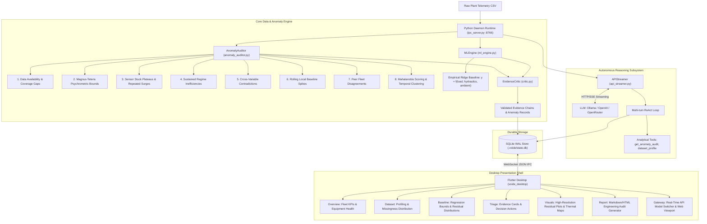

# V.O.I.D.E. — Autonomous Multi-Layer Telemetry Anomaly Detection & Industrial Equipment Health Monitoring System

[](https://python.org)
[](https://flutter.dev)
[](LICENSE)
[]()
[]()
[]()

**V.O.I.D.E.** is an autonomous, open-source industrial telemetry anomaly detection and equipment health monitoring system. Engineered for chiller plants, industrial IoT installations, and continuous energy monitoring infrastructure, V.O.I.D.E. replaces simplistic fixed-threshold alarms with a rigorous **8-layer mathematical and physical auditing pipeline**, empirical **expected-behaviour multivariate regression**, **ASHRAE Guideline 14 temporal persistence clustering**, zero-trust **Evidence Critic guardrails**, and an autonomous **API-streaming reasoning agent**.

---

## Key Capabilities

- **8-Layer Physics & Statistical Telemetry Audit**: Zero hardcoded thresholds. Evaluates data availability dropouts, psychrometric thermodynamic residuals (Magnus-Tetens formulation), frozen sensor plateaus, corrupted meter surges, sustained regime inefficiencies (>30% energy elevation over peer median), cross-variable contradictions, rolling local baseline spikes, and peer fleet disagreements.
- **Empirical Expected-Behaviour Baseline Models**: Fits multivariate regularized Ridge regression ($\hat{y} = f(\text{load, hydraulics, ambient weather})$) per equipment unit, quantifying contextual deviations via normalized residual z-scores rather than naive static limits.
- **ASHRAE Guideline 14 Persistence Clustering**: Groups contiguous point deviations into verified operational anomaly episodes ($\ge 3$ consecutive intervals / $\ge 1.5$ hours), preventing false alarm fatigue from transient operational surges.
- **Evidence Critic Zero-Trust Guardrails**: Eliminates physical fault hallucination. Forbids attributing telemetry deviations to specific mechanical teardown failures (e.g. compressor bearing seizure, refrigerant loss) without direct acoustic, vibration, or teardown inspection evidence.
- **Pure API-Key Streaming Reasoning Engine**: Direct Server-Sent Events (SSE) integration with local [Ollama](https://ollama.com/) (`http://localhost:11434/v1`), OpenAI (`gpt-4o`, `o1`), OpenRouter, vLLM, or DeepSeek. Zero browser emulation, Chromium headless overhead, or DOM scraping dependencies.
- **Reactive Flutter Linux Desktop Triage Station**: Multi-surface engineering console providing fleet overview, dataset quality profiling, baseline regression evaluations, evidence-linked anomaly cards, visual residual plots, automated engineering audit reports, and live AI model gateway management.
- **Dual-Mode Execution**: Run with the interactive desktop interface or as a lightweight, headless background daemon (`./launch_voide.sh --daemon-only`) for automated CI/CD and telemetry ingestion pipelines.
- **Durable Crash-Resilient ACID Storage**: SQLite WAL backend (`.voide/state.db`) maintaining datasets, quality profiles, anomaly episodes, evidence chains, and chat sessions with zero data loss across reboots.

---

## System Architecture



---

## The 8-Layer Anomaly Detection Pipeline

The detection pipeline is implemented in [AnomalyAuditor](agent/data_engine/anomaly_auditor.py):

| Layer | Anomaly Category | Detection Principle & Mathematical Formulation |
| :--- | :--- | :--- |
| **1** | **Data Availability** | Identifies multi-row dropouts and timestamp discontinuities where $\Delta t > 1.5 \times \text{median}(\Delta t)$. |
| **2** | **Physical Inconsistency** | Uses **Magnus-Tetens** psychrometric formula $e_s(T) = 6.112 \exp(\frac{17.67 T}{T + 243.5})$ to compute expected relative humidity $RH_{\text{calc}} = 100 \cdot \frac{e_s(T_{\text{dew}})}{e_s(T_{\text{dry}})}$. Flags discrepancies where $\|RH_{\text{obs}} - RH_{\text{calc}}\| > 15\%$ or unphysical values ($<0\%$ or $>100\%$). |
| **3** | **Stuck Sensor Plateaus & Surges** | Detects zero-variance flatlines sustained across $\ge 10$ steps during dynamic plant operation, and flags repeated identical unphysical meter surges. |
| **4** | **Sustained Regime Inefficiencies** | Detects sustained low hydraulic flow ratios and specific energy consumption ($kWh/\text{Ton}$) sustained $>30\%$ above peer median under equivalent operating load. |
| **5** | **Cross-Variable Contradictions** | Identifies physical contradictions across simultaneous operational channels (e.g., electrical power draw remains high while cooling load collapses to zero). |
| **6** | **Rolling Baseline Spikes** | Filters localized transient spikes using dynamic rolling windows: $\|x(t) - \mu_{\text{roll}}(t)\| > 3.0 \cdot \sigma_{\text{roll}}(t)$. |
| **7** | **Peer Fleet Disagreements** | Compares parallel units (e.g. Chiller-01 vs Chiller-02 vs Chiller-03) on a shared loop using robust median absolute deviation (MAD) scoring to isolate unit-specific degradation. |
| **8** | **Multivariate Mahalanobis & Persistence** | Computes multivariate operational divergence $D_M(\mathbf{x}) = \sqrt{(\mathbf{x}-\boldsymbol{\mu})^T \boldsymbol{\Sigma}_{\text{reg}}^{-1} (\mathbf{x}-\boldsymbol{\mu})}$ and clusters contiguous points into verified anomaly episodes with ASHRAE Guideline 14 persistence ($\ge 3$ steps / $\ge 1.5$ hours). |

---

## Quickstart Guide

### 1. Prerequisites

- **Linux OS** (Ubuntu 22.04+, Debian 12+, Fedora, Arch Linux)
- **Python 3.10+** (tested through Python 3.13)
- **Flutter SDK** (3.19+ for desktop compilation; optional when running in headless daemon mode)
- Recommended: [Ollama](https://ollama.com/) for zero-cost, private offline local LLM reasoning

### 2. Installation

```bash
git clone https://github.com/your-username/V.O.I.D.E.git
cd V.O.I.D.E

# Create and activate virtual environment
python3 -m venv .venv
source .venv/bin/activate

# Install dependencies in editable mode
pip install -e .
```

### 3. Configure Reasoning Backend

Copy the environment template:
```bash
cp .env.example .env
```

Select your preferred LLM provider in `.env`:

#### Option A: Local Offline AI with Ollama (100% Free & Private)
```bash
# 1. Install Ollama and pull a model
ollama run llama3.1
```
Configure `.env`:
```ini
OPENAI_BASE_URL=http://localhost:11434/v1
OPENAI_MODEL=llama3.1
VOIDE_LLM_PROVIDER=ollama
OPENAI_API_KEY=
```

#### Option B: OpenAI Cloud
```ini
OPENAI_API_KEY=sk-proj-your-api-key
OPENAI_BASE_URL=https://api.openai.com/v1
OPENAI_MODEL=gpt-4o
VOIDE_LLM_PROVIDER=openai
```

#### Option C: OpenRouter Multi-Model Gateway
```ini
OPENAI_API_KEY=sk-or-v1-your-key
OPENAI_BASE_URL=https://openrouter.ai/api/v1
OPENAI_MODEL=anthropic/claude-3.5-sonnet
VOIDE_LLM_PROVIDER=openrouter
```

### 4. Launching V.O.I.D.E.

Launch both the background IPC daemon and the Flutter desktop interface:
```bash
./launch_voide.sh
```

To run exclusively the background daemon (headless server or automated telemetry pipeline):
```bash
./launch_voide.sh --daemon-only
# Or directly via Python module:
python3 -m agent.runtime.ipc_server .
```

---

## Desktop Triage Surfaces

| Surface | Purpose |
| :--- | :--- |
| **OVERVIEW** | Facility KPIs, active telemetry dataset status, persistent anomaly episode tallies, and fleet health indicators. |
| **DATASET** | Ingestion pipeline, automated quality profiling, null-rate distribution by channel, and schema signatures. |
| **BASELINE** | Empirical baseline regression ($\hat{y}$ vs $y$), $R^2$ evaluations, and contextual expected-behaviour bounds. |
| **TRIAGE** | Evidence-linked anomaly investigation cards, persistence checks ($\ge 3$ steps), and human decision actions. |
| **VISUALS** | High-resolution residual plots, thermal maps, and multi-sensor correlation diagrams. |
| **REPORT** | Markdown and HTML engineering audit report generator with export capabilities. |
| **GATEWAY** | Real-time AI Model & API configuration, endpoint hot-swapping, and live Web Viewport preview. |
| **FILES** | Workspace directory tree, telemetry inspection, and live Linux PTY terminal. |

---

## Core Components Reference

- [AnomalyAuditor](agent/data_engine/anomaly_auditor.py): 8-layer physical and statistical anomaly audit engine.
- [MLEngine](agent/data_engine/ml_engine.py): Empirical regularized Ridge regression, contextual residuals, Mahalanobis distance metric, and temporal persistence clustering.
- [EvidenceCritic](agent/data_engine/critic.py): Strict epistemic guardrail preventing unsupported physical fault hallucination.
- [APIStreamer](agent/runtime/api_streamer.py): Pure HTTP/SSE streaming client and multi-turn ReAct reasoning loop.
- [IPCServer](agent/runtime/ipc_server.py): Asynchronous WebSocket server connecting desktop GUI to agent subsystems (`ws://127.0.0.1:8766`).
- [StateStore](agent/storage/state_store.py): SQLite WAL parameterized persistence engine.

---

## WebSocket IPC Protocol Specification

The desktop shell interacts with [IPCServer](agent/runtime/ipc_server.py) over `ws://127.0.0.1:8766`.

### Request Anomaly Audit (`get_anomaly_audit`)
```json
{
  "action": "get_anomaly_audit",
  "id": "req-1",
  "payload": {
    "file_path": "data/plant_telemetry.csv"
  }
}
```

### Dynamic LLM Configuration (`llm_set_config`)
```json
{
  "action": "llm_set_config",
  "id": "req-2",
  "payload": {
    "provider": "ollama",
    "base_url": "http://localhost:11434/v1",
    "model": "llama3.1",
    "api_key": ""
  }
}
```

### Streaming Broadcast Event (`CHAT_STREAM`)
```json
{
  "type": "CHAT_STREAM",
  "session_id": "session-uuid",
  "delta": " identified persistent flow depression of -28.4%",
  "full_text": "Audit identified persistent flow depression of -28.4% on Chiller-01...",
  "done": false
}
```

---

## Verification & Testing

V.O.I.D.E. enforces hermetic test suites with zero external network dependencies:

```bash
# Run all Python unit and integration tests
pytest -v

# Run targeted anomaly auditor and ML engine tests
pytest tests/unit/test_anomaly_auditor.py tests/unit/test_ml_engine.py -v

# Run API streamer tests
pytest tests/unit/test_api_streamer.py -v

# Run Flutter desktop static analysis
cd apps/voide_desktop && flutter analyze
```

---

## Documentation Index

- [Architecture Deep Dive](docs/architecture/ARCHITECTURE.md)
- [API Configuration & IPC Reference](docs/protocols/API_AND_CONFIG.md)
- [Contributing Guidelines](docs/CONTRIBUTING.md)

---

## License

V.O.I.D.E. is licensed under the [MIT License](LICENSE).
