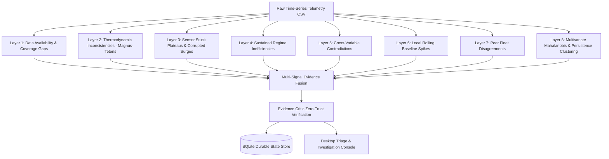

# V.O.I.D.E. System Architecture & Engineering Specifications

This document defines the architectural topology, algorithmic pipelines, physical models, and runtime guarantees of **V.O.I.D.E.** (**Autonomous Multi-Layer Telemetry Anomaly Detection & Industrial Equipment Health Monitoring System**).

---

## 1. Topological Decomposition

V.O.I.D.E. operates as a decoupled, asynchronous multi-process architecture engineered for industrial IoT telemetry ingestion, mathematical anomaly auditing, empirical baseline modeling, and evidence-grounded engineering triage:

```
┌────────────────────────────────────────────────────────────────────────┐
│                   Flutter Desktop Client (Dart)                        │
│  - Triage Console: Evidence Cards, Persistence Checks, Human Review    │
│  - Visual Analytics: Residual Scatters, Time Series, Thermal Maps      │
│  - Profiler & Ingestion: Null Distributions, Schema & Covariance       │
│  - Model Gateway: Dynamic API Backend Switcher & Live Web Viewport     │
└───────────────────────────────────▲────────────────────────────────────┘
                                    │
                      WebSocket JSON IPC (Port 8766)
                                    │
┌───────────────────────────────────▼────────────────────────────────────┐
│                    Python Asynchronous Daemon Runtime                  │
│  - IPCServer: Message multiplexing, real-time broadcasts, session mgmt │
│  - AnomalyAuditor: 8-layer physical & statistical telemetry auditor    │
│  - MLEngine: Ridge regression baselines & Mahalanobis distance metric  │
│  - EvidenceCritic: Zero-trust physical claim & fault validation guard  │
│  - APIStreamer: Direct HTTP/SSE streaming & multi-turn ReAct loop      │
│  - ProcessManager: Non-blocking background worker supervisor           │
└───────────────────────────────────▲────────────────────────────────────┘
                                    │
                        SQLite WAL Storage Engine
                                    │
┌───────────────────────────────────▼────────────────────────────────────┐
│                     .voide/state.db (Durable Store)                    │
│  - Datasets, Quality Profiles, Channel Variance Statistics             │
│  - Anomaly Episodes, Evidence Chains, Epistemic Validation Status      │
│  - Audit Reports, Baseline Model Weights, Chat Investigation Threads   │
└────────────────────────────────────────────────────────────────────────┘
```

---

## 2. Multi-Layer Telemetry Anomaly Detection Pipeline

The core analytical pipeline is implemented in [AnomalyAuditor](../../agent/data_engine/anomaly_auditor.py). Telemetry is audited across 8 deterministic, physics-grounded and statistical evaluation layers with zero hardcoded thresholds:



### Layer 1: Data Availability Failures & Coverage Gaps
- **Contiguous Missing Blocks**: Detects multi-row dropouts across specific channels or entire equipment units where sensor signals drop to `NaN` or unrecorded intervals.
- **Coverage Gaps**: Analyzes timestamp delta distributions ($\Delta t$). If $\Delta t > 1.5 \times \text{median}(\Delta t)$, a temporal coverage discontinuity is registered.

### Layer 2: Physical & Thermodynamic Inconsistencies
Validates psychrometric and thermodynamic constraints using the **Magnus-Tetens** formulation. Saturated vapor pressure $e_s(T)$ is computed from ambient dry-bulb temperature $T_{\text{dry}}$ and dew point $T_{\text{dew}}$:
$$e_s(T) = 6.112 \cdot \exp\left(\frac{17.67 \cdot T}{T + 243.5}\right)$$
Expected relative humidity is derived from vapor pressure ratios:
$$RH_{\text{calc}} = 100 \cdot \frac{e_s(T_{\text{dew}})}{e_s(T_{\text{dry}})}$$
- Residual distribution analysis: $|RH_{\text{observed}} - RH_{\text{calc}}| > 15\%$ flags sensor calibration drift or faulty instrumentation.
- Unphysical bounds checks ($RH < 0\%$ or $RH > 100\%$, temperatures exceeding physical limits).

### Layer 3: Sensor Stuck Plateaus & Corrupted Meter Surges
- **Stuck Plateaus**: Identifies sensors reporting identical values over extended consecutive intervals ($\ge 10$ steps) during periods when parallel peer sensors or driving loads fluctuate.
- **Corrupted Surges**: Identifies intermittent, identical non-physical spikes that repeat across time without corresponding dynamic changes in equipment load.

### Layer 4: Sustained Regime Inefficiencies
- **Hydraulic Flow Depression / Saturation**: Sustained low flow ratio relative to peer median flow under non-zero load.
- **Sustained Energy Elevation**: Specific energy consumption ($kWh / \text{Ton}$ or $kW$) sustained $>30\%$ above peer median under equivalent operating loads.
- **Cooling Water Temperature Delta Offset**: Sustained departure in condenser water supply/return temperature differential ($\Delta T_{\text{cw}}$) relative to loop consensus.

### Layer 5: Cross-Variable & Operational Contradictions
Detects physically contradictory states across simultaneous operational channels:
- Electrical power draw remains high while cooling load collapses to near-zero.
- Flow rate indicates active pumping with zero thermodynamic temperature differential.
- Multi-sensor transient collapse where correlated physical channels diverge instantaneously.

### Layer 6: Rolling Local Baseline Spikes
Filters high-frequency stochastic noise from true structural anomalies using localized rolling windows:
$$\mu_{\text{roll}}(t) = \frac{1}{W} \sum_{i=t-W}^{t} x_i, \quad \sigma_{\text{roll}}(t) = \sqrt{\frac{1}{W}\sum_{i=t-W}^{t} (x_i - \mu_{\text{roll}}(t))^2}$$
Flagging condition: $|x(t) - \mu_{\text{roll}}(t)| > 3.0 \cdot \sigma_{\text{roll}}(t)$.

### Layer 7: Peer Fleet Disagreements
Compares parallel units (e.g., Chiller-01 vs Chiller-02 vs Chiller-03) operating under identical building loop headers:
- Calculates robust z-scores against the peer fleet median:
$$z_{\text{peer}}(t) = \frac{x_i(t) - \text{median}_{j \in \text{fleet}}(x_j(t))}{\text{IQR}_{\text{fleet}}(t) / 1.349}$$
Disagreements sustained across multiple intervals indicate entity-specific degradation rather than building-level demand variations.

### Layer 8: Multivariate Mahalanobis Distance & Temporal Persistence Clustering
Implemented in [MLEngine](../../agent/data_engine/ml_engine.py):
- **Mahalanobis Distance Metric**: Computes multivariate operational divergence across all continuous telemetry channels simultaneously using a Ridge-regularized covariance matrix:
$$\boldsymbol{\Sigma}_{\text{reg}} = \boldsymbol{\Sigma} + \lambda \mathbf{I} \quad (\lambda = 10^{-4})$$
$$D_M(\mathbf{x}) = \sqrt{(\mathbf{x} - \boldsymbol{\mu})^T \boldsymbol{\Sigma}_{\text{reg}}^{-1} (\mathbf{x} - \boldsymbol{\mu})}$$
- **ASHRAE Guideline 14 Temporal Persistence Rule**: Prevents false alarm fatigue from transient operational surges. A sequence of deviations is only flagged as a verified anomaly episode if the condition holds for:
$$\text{Persistence} \ge 3 \text{ consecutive intervals } (\ge 1.5 \text{ hours at 30-min sampling})$$

---

## 3. Empirical Expected-Behaviour Baseline Models

To prevent misidentifying legitimate high-load peak operation as a fault, [MLEngine](../../agent/data_engine/ml_engine.py) learns an empirical contextual expected-behaviour model:

$$\hat{y} = f(\text{Cooling Load, Chilled Water Flow, Condenser Water Temperatures, Wet-Bulb})$$

### Regularized Ridge Formulation
For each equipment entity, normalized feature matrix $\mathbf{X}$ is solved with regularized $L_2$ penalty:
$$\mathbf{w} = (\mathbf{X}^T \mathbf{X} + \alpha \mathbf{I})^{-1} \mathbf{X}^T \mathbf{y}$$

### Residual Z-Score Normalization
Contextual residuals reflect operational divergence from the learned baseline:
$$e(t) = y(t) - \hat{y}(t)$$
$$z_{\text{res}}(t) = \frac{e(t) - \mu_e}{\sigma_e}$$
Model quality is evaluated against ASHRAE Guideline 14 criteria:
- Coefficient of Determination ($R^2 \ge 0.70$)
- Coefficient of Variation of Root Mean Square Error ($CV(RMSE) \le 30\%$)

---

## 4. Evidence Critic & Epistemic Guardrails

A major risk in automated telemetry systems is the hallucination of physical equipment teardown faults without direct sensing evidence. [EvidenceCritic](../../agent/data_engine/critic.py) enforces strict zero-trust boundary validation:

1. **Unsupported Hardware Fault Rejection**:
   Scans diagnostic narratives for speculative hardware conclusions (e.g., "compressor bearing seizure", "impeller blade fracture", "refrigerant leak") that cannot be established from energy and temperature telemetry alone.
2. **Automated Epistemic Correction**:
   Rewrites speculative mechanical assertions to defensible engineering terminology:
   - *Speculative*: "Compressor bearing failure on Chiller-02"
   - *Validated*: "Persistent contextual energy elevation (specific mechanical fault not established from sensor telemetry; requires physical vibration/acoustic inspection)"
3. **Traceable Evidence Binding**:
   Every reported anomaly episode must be bound to verifiable observation metrics: start/end timestamps, duration, observed mean vs. expected mean, and peak z-score.

---

## 5. Reasoning Engine & API-Streaming ReAct Loop

V.O.I.D.E. pairs empirical data auditing with an autonomous reasoning engine ([APIStreamer](../../agent/runtime/api_streamer.py)):

- **Pure API Streaming**: Zero browser emulation or Chromium overhead. Connects directly to OpenAI, local Ollama (`http://localhost:11434/v1`), OpenRouter, or DeepSeek via Server-Sent Events (SSE).
- **Multi-Turn ReAct Loop**:
  1. *Hypothesis Formulation*: Formulates operational hypotheses based on telemetry anomalies.
  2. *Tool Execution*: Executes local inspection tools (`get_anomaly_audit`, `dataset_profile`, `read_file`, `bash`).
  3. *Observation Feedback*: Incorporates quantitative observations into context.
  4. *Evidence Verification*: Validates conclusions through [EvidenceCritic](../../agent/data_engine/critic.py) before presenting to the human engineer.

---

## 6. Storage Architecture & Crash Resilience

All state is preserved in an ACID-compliant SQLite WAL database at `.voide/state.db`:
- **Strict Parameterization**: Parameterized `?` queries prevent injection vulnerabilities.
- **Relational Integrity**: Foreign key cascading across datasets, telemetry profiles, anomaly episodes, and evidence records.
- **Relational Schema**:
  - `datasets`: Ingested telemetry metadata, row counts, sampling intervals, SHA-256 hashes.
  - `data_profiles`: Channel null rates, mean, variance, quartile distributions.
  - `anomalies`: Anomaly UUIDs, classification layers, start/end bounds, severity, confidence scores.
  - `evidence`: Quantitative observation payloads, expected vs observed deltas, validation status.
  - `chat_sessions` & `chat_messages`: Multi-turn investigation history and tool execution payloads.
